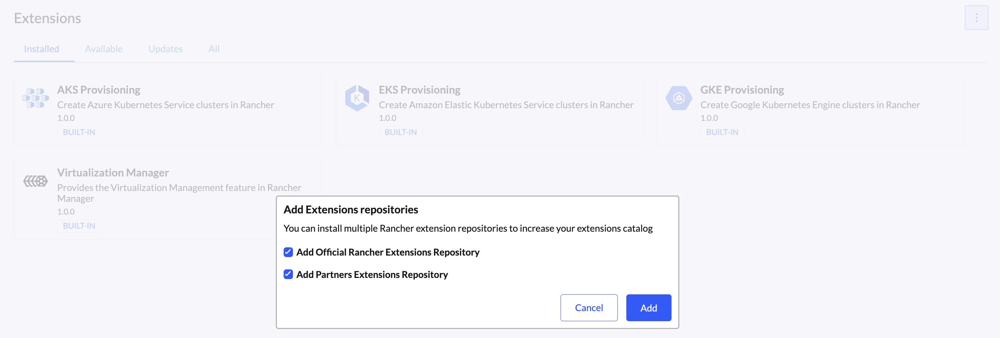
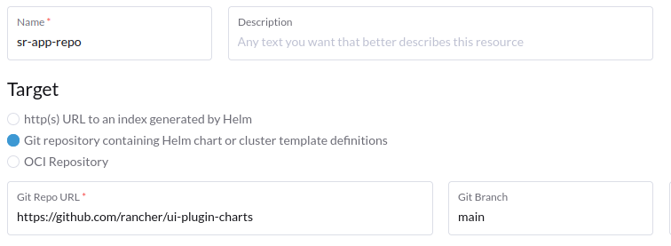
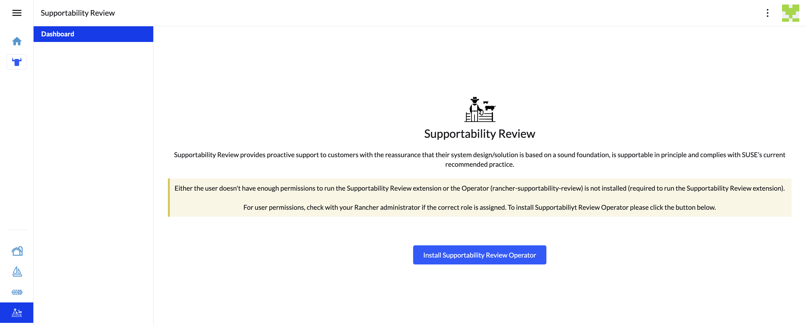
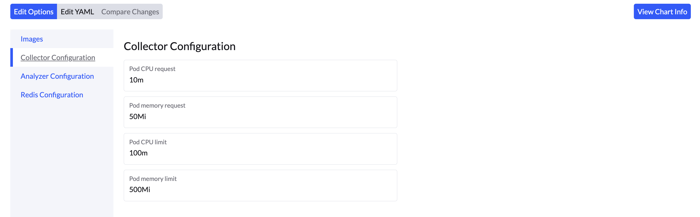
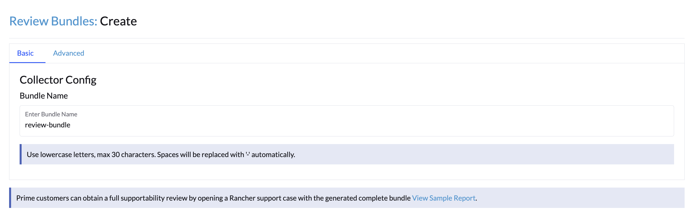
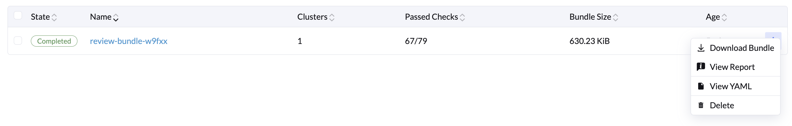
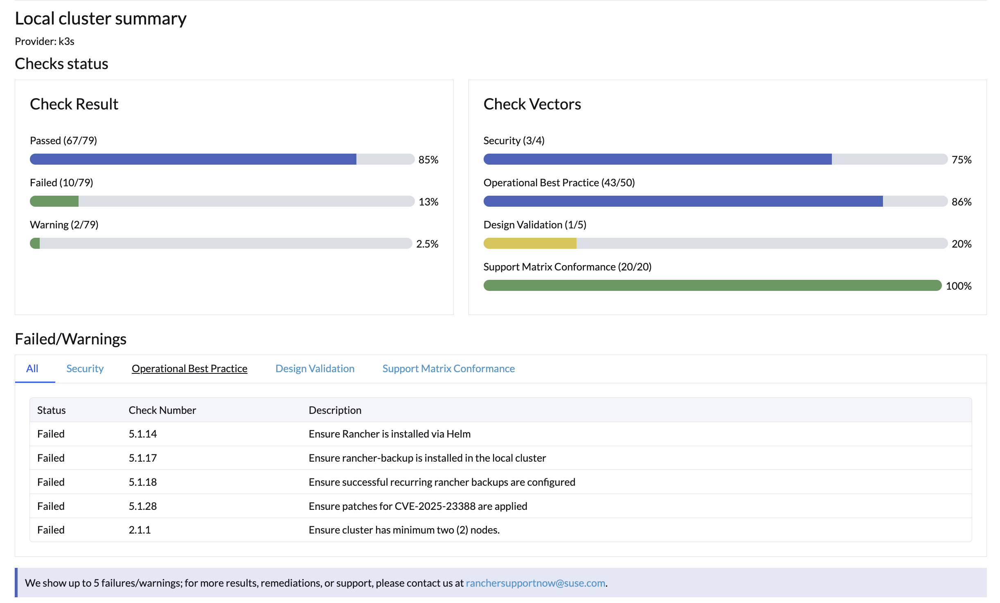

# Supportability Review - Rancher Extension

The **Supportability Review** (SR) extension helps proactively validate your Rancher managed kubernetes cluster configuration and environment to ensure it's production-ready and support-aligned.

It provides:

- **Best Practice Validation**: Verifies that your cluster design adheres to **SUSE-recommended architecture** for optimal supportability.
- **Support Matrix Compliance**: Checks whether your cluster meets all **SUSE supportability requirements** for reliable and successful operation.
- **CVE Awareness**: Alerts you to **known CVEs (Common Vulnerabilities and Exposures)** that may affect your cluster components.

---

## Installation Guide

Follow the steps below to install the Supportability Review extension inside Rancher UI:

### 1. Open Extensions Menu

- Navigate to the **bottom-left hamburger menu** in the Rancher UI.
- Click on **Extensions → Available / All Extensions**.


### 2. Add the Extension to the Available Extensions List

#### Rancher Prime
- Click the **three dots** (⋮) on the extensions page.
- Select **Add Rancher Repositories**.
- Wait a few seconds while the repository syncs.
- You will now see the **Supportability Review** extension listed.


#### Rancher Community
To view the Supportability Review extension in the Extensions list:
- Click the **three dots** (⋮) on the Extensions page.
- Select **Manage Repository**.
- Click the **Create** button.
- Choose **Git repository containing Helm chart or cluster template definitions**.
- Fill in the following details:
  - **Name**: `supportability-review` (optional)
  - **Repository URL**: `https://github.com/rancher/supportability-review-app`
  - **Branch**: `gh-pages`
- Click **Create**.
- Wait a few seconds for the repository to sync.
- The **Supportability Review** extension will now appear in the list.



### 3. Install the Extension

- Click on the **Supportability Review** entry.
- Click the `Install` button.

Once installed, a new **Cattleman icon** will appear in the side menu.

---

## Post-Installation Setup

### 4. Install the Supportability Review Operator

- Click the **Supportability Review (SR) icon** in the sidebar.
- Press the button: `Add Supportability Review Operator Repository`.
- Then click `Install Supportability Review Operator`.


During the installation process, you can configure the following components (We recommend keeping the default settings):
- **Images**: Repository details for collector and analyzer images.
- **Collector Configuration**: CPU, memory limits for the collector container.
- **Analyzer Configuration**: CPU, memory limits for the analyzer container.
- **Redis Configuration**: CPU, memory, and ephemeral storage limits for the Redis container.

  

---

##  Getting Started

### 5. Create a Review Bundle

- Click the `Get Started` button from the Dashboard to begin creating your first review report.
- You will be redirected to the **Create Review** page with two tabs:

  #### a. Basic Tab
  - Enter a custom bundle name (default: `review-bundle`).

  #### b. Advanced Tab
  - Change the namespace for Sonobuoy.
  - Add node tolerations.
  - Write a bundle description.

we recommend keeping the default values

**Prime customers** can obtain a full supportability review by opening a Rancher support case and sharing the generated review bundle.  
You can also preview what a full report looks like by clicking the **[View Sample Report](https://suse.my.salesforce.com/sfc/p/#1i000000gLOd/a/Tr00000EFJwk/2gpLmKqcybjI6R_YjwtXwx4qNnKFsOSTmf8SNQvQLbQ)** link.

---

## View and Manage Review Bundles

- After creation, a review job is launched and enters a `Running` state.
- Navigate to the **Review Bundles** tab to see:
  - A list of all previously created bundles, including:
    - Number of clusters
    - Number of passed checks
    - Bundle size


- On the right side of each bundle entry, click the **three-dot menu (⋮)** to:
  - **Download** the bundle
  - **View** the report
- Click on the bundle name or select View Report from the **three-dot menu (⋮)** to view a detailed visual report of your local cluster.

---

## Air-Gap Install
Pull and push required images into private registry.
```
$ docker pull rancher/supportability-review:latest
$ docker pull rancher/supportability-review-internal:latest
$ docker pull rancher/supportability-review-operator:latest
$ docker pull rancher/supportability-review-app-frontend:latest
$ docker pull rancher/mirrored-library-redis:7.2.9

$ docker tag rancher/supportability-review:latest ${PRIVATE_REGISTRY_IP_ADDRESS}:5000/rancher/supportability-review:latest
$ docker tag rancher/supportability-review-internal:latest ${PRIVATE_REGISTRY_IP_ADDRESS}:5000/rancher/supportability-review-internal:latest
$ docker tag rancher/supportability-review-operator:latest ${PRIVATE_REGISTRY_IP_ADDRESS}:5000/rancher/supportability-review-operator:latest
$ docker tag rancher/supportability-review-app-frontend:latest ${PRIVATE_REGISTRY_IP_ADDRESS}:5000/rancher/supportability-review-app-frontend:latest
$ docker tag rancher/mirrored-library-redis:7.2.9 ${PRIVATE_REGISTRY_IP_ADDRESS}:5000/rancher/mirrored-library-redis:7.2.9

$ docker push ${PRIVATE_REGISTRY_IP_ADDRESS}:5000/rancher/supportability-review:latest
$ docker push ${PRIVATE_REGISTRY_IP_ADDRESS}:5000/rancher/supportability-review-internal:latest
$ docker push ${PRIVATE_REGISTRY_IP_ADDRESS}:5000/rancher/supportability-review-operator:latest
$ docker push ${PRIVATE_REGISTRY_IP_ADDRESS}:5000/rancher/supportability-review-app-frontend:latest
$ docker push ${PRIVATE_REGISTRY_IP_ADDRESS}:5000/rancher/mirrored-library-redis:7.2.9
```

---

## Alternative: Use Offline Supportability Review

If the **UI extension** does not work or is unavailable in your setup, you can use the **offline Supportability Review method** instead.

Please follow the instructions provided here: [Supportability Review](https://github.com/rancherlabs/support-tools/tree/master/collection/rancher/v2.x/supportability-review)

---

## Feedback & Issues

If you encounter any bugs, installation issues, or have suggestions for improvement, please [open an issue](https://github.com/rancher/supportability-review-app/issues) in this repository.

For further assistance, including detailed results, remediations, or a full supportability review, feel free to contact us at:
 **ranchersupportnow@suse.com**

---
